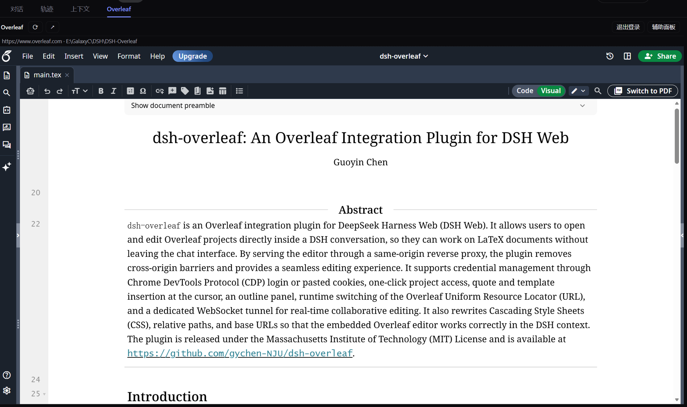
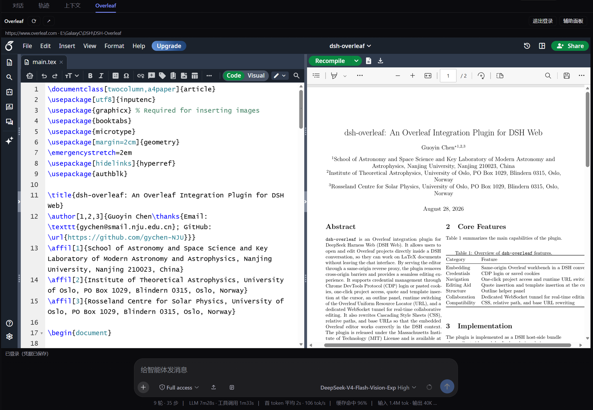
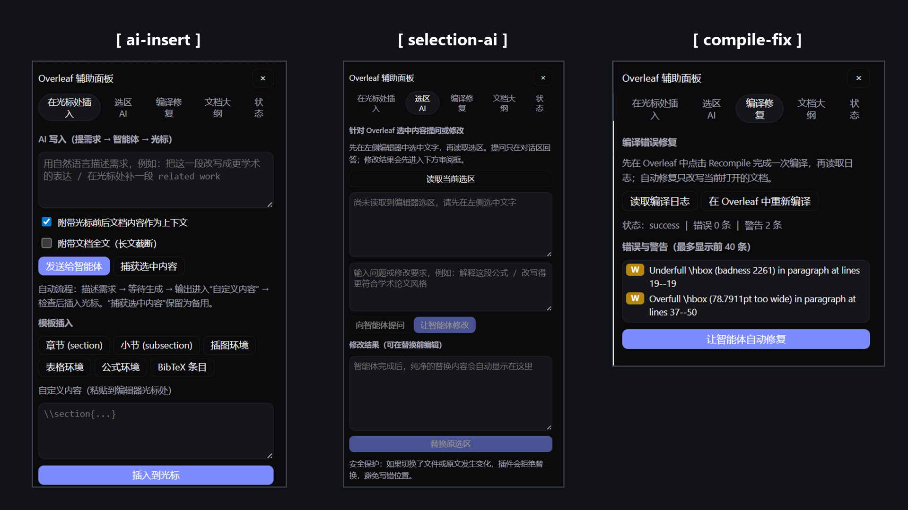

# dsh-overleaf

[English](README.md) | [中文](README.zh.md)

An embedded **Overleaf workbench** plugin for DeepSeek Harness (DSH) Web. It adds a fourth tab next to `Chat / Trajectory / Context` on the session page: the tab loads your Overleaf site (public cloud or self-hosted such as `https://tex.nju.edu.cn`) through a same-origin reverse proxy, so the page renders and **stays fully operable** — editing, compiling, PDF preview — while the native DSH composer stays below it, with selection quoting, caret insertion, and LaTeX assist panels wired between the two.

```
+--------------------------------------------------------------+
|  Session tabs:   Chat | Trajectory | Context | [Overleaf]     |
+--------------------------------------------------------------+
|  toolbar: reload / open window / login / cookie / panel       |
|  +----------------------------------------------------------+ |
|  |  https://.../overleaf-proxy/... (same-origin iframe)      | |
|  |  full Overleaf editor, compiler, and PDF preview          | |
|  +----------------------------------------------------------+ |
|  floating quote CTA - selection bridge                        |
|  status strip / assist panel (AI write, selection AI, outline)|
+--------------------------------------------------------------+
|  DSH composer (native, untouched)                             |
+--------------------------------------------------------------+
```

- License: MIT
- Target runtime: DeepSeek Harness `0.1.1-rc.2`, web profile (`http://127.0.0.1:3080`)
- Protocol: ships a static Community v0.15 `dsh-plugin.json` per the [dsh-std](https://github.com/Yan-Zero/dsh-std) interoperability spec; classic dual-face bundle loading remains the primary activation path.

## Screenshots

**The Overleaf editor running inside a DSH conversation tab** — full editor with project file tree, and the DSH composer stays below:



**Split view: LaTeX source and PDF preview side by side**, with Recompile — compile, preview, and iterate without leaving the conversation:



**Assist panel — three tools side by side**: AI write & auto-captured insert, selection AI with reviewed replace, and compile fix (log errors/warnings with one-click agent fixes):



- **`[ ai-insert ]`** — describe the change, the DSH agent writes it, and the panel **automatically captures the agent's output into the custom-content box** — review it, then insert at the editor caret.
- **`[ selection-ai ]`** — select text in the editor, ask the agent to explain or rewrite it, review the replacement, then replace the original selection (guarded against file/selection drift).
- **`[ compile-fix ]`** — read the compile log's errors and warnings after a Recompile, then let the agent propose fixes for the currently open document.

## Why it exists

Overleaf sends `X-Frame-Options` / CSP `frame-ancestors` on every response, so a plain `<iframe src="https://tex.nju.edu.cn">` is refused by browsers. This plugin ships an HTTP/1.1 reverse proxy inside the DSH host process: all browser traffic goes to `/overleaf-proxy/<original-path>` which forwards to your configured upstream origin — one fixed origin, locked by configuration, no open SSRF surface. Because the iframe and the GUI then share one origin, browser-level bridges become possible: text selections flow out of the embedded editor into the composer as structured quotes, and generated content can be written back at the editor caret.

## Feature map (spec coverage)

| Requirement | Status |
|---|---|
| R1 · fourth session-page tab | `conversation.view` entry `id:"overleaf"`, `order:30`; visible whenever the tab bar shows (`tabs >= 2`) |
| R2 · configurable site address | Settings page (`Settings > Plugins > Plugin configuration > dsh-overleaf`) edits `baseUrl`; saving hot-swaps the proxy target without a restart |
| R3 · original site features usable | Streaming reverse proxy preserves paths and query strings; responses pass through minus framing headers; small HTML bodies get link/asset rebasing plus the bridge script |
| R4 · native composer below | The view replaces only the message area; composer, workspace recording, deliverables untouched |
| R5 · selection quoting | `selectionchange` in the iframe surfaces a floating quote button; clicking inserts a structured quote chip through the official reference pipeline (`inputTriggers.registerSource({name:'quote-ref'})` codec), falling back to plain-text block quotes when absent |
| R6 · generate at caret | Template inserts and free-form/agent-generated LaTeX write to the live cursor through CodeMirror APIs (CM5 primary, CM6 probe, editable fallback); agent output is captured into a review box before insertion |
| R7 · assist features | Assist panel: ask the agent about an editor selection or generate a reviewable, conflict-checked replacement; read the compile log and auto-fix errors/warnings via a reviewed agent edit list (applied only when every `old` matches uniquely); document outline with jump-to-line flashing; login/logout/cookie management; status reporting (`editorAssistEnabled` toggle = `assistPanelEnabled`) |

## Installation

The npm package name `dsh-overleaf` is occupied by another project, so this plugin is **not published to npm** — install it from GitHub instead. The repository commits the prebuilt `lib/` bundle, so git installs need **no build step and no `allowBuilds` authorization**:

```sh
# From GitHub, tracking the main branch (recommended for latest features):
dsh plugin --profile web add github:gychen-NJU/dsh-overleaf

# Or pin an exact released version:
dsh plugin --profile web add github:gychen-NJU/dsh-overleaf#v0.3.8
```

From a release tarball (download the `.tgz` attached to the [latest release](https://github.com/gychen-NJU/dsh-overleaf/releases)):

```sh
dsh plugin --profile web add ./dsh-overleaf-0.3.8.tgz
```

Then restart the web service once (client bundles join the boot graph at startup):

```sh
dsh --profile web web        # or however you normally start it
```

Verify composition survived:

```sh
dsh --profile web --dump-config   # expect a "# == dsh-overleaf" block
```

The default upstream is `https://www.overleaf.com`. To point the workbench at any other instance (self-hosted Overleaf, `tex.nju.edu.cn`, ...), open Settings > Plugins > Plugin configuration > dsh-overleaf, change `baseUrl`, and save — the proxy target hot-swaps without a restart.

Uninstall cleanly at any time:

```sh
dsh plugin --profile web remove dsh-overleaf
```

### Coexistence guarantees

Deliberate isolation from existing plugins/configs:

| Surface | dsh-overleaf claim | Other known claims |
|---|---|---|
| Cordis row id | `overleaf-workbench` | `overleaf` (better-overleaf) |
| Client module id | `dsh-overleaf` (must equal the package name) | `dsh-better-overleaf` |
| HTTP routes | `/overleaf-proxy/*`, `/overleaf/workbench/*` | `/overleaf/*` (better-overleaf), `/api/dsh-browser/*` |
| WS upgrades | `/overleaf-proxy/socket.io[/]` exact | none known |
| Credential ref | `OVERLEAF_WORKBENCH_COOKIE` | `OVERLEAF_COOKIE` / `OVERLEAF_GIT_TOKEN` |
| Data dir | `~/.dsh/plugin-data/dsh-overleaf-workbench/browser-profile` | `~/.dsh/plugin-data/dsh-overleaf/...` |
| Conversation view id | `overleaf` order 30 | chat 0 / trajectory 10 / context 20 |

Both halves fail soft: a missing `credentials` service disables stored cookies (manual-paste mode degrades per request), missing `settings` skips the settings card, and any client-half exception logs instead of throwing so GUI boot never breaks.

## Architecture

```
src/
  index.ts          host re-exports + default Service class (cordis loader target)
  service.ts        routes, status/login/projects ops, settings namespace wiring
  config.ts         schemastery schema + defaults + origin normalization
  proxy.ts          ReverseProxy: streaming HTTP proxy + raw upgrade tunnel
  inject-script.ts  source of the browser bridge script (bridge.js)
  login-cdp.ts      direct-CDP login (ported from Hoemr/dsh-better-overleaf, MIT)
  credentials.ts    OVERLEAF_WORKBENCH_COOKIE credentialRef
  types.ts          wire shapes
  client/
    index.ts        client half apply(): dictionaries, quote-ref source, view slot,
                    settings card slot (soft settingsScope wait)
    view.tsx        OverleafView component (toolbar/iframe/CTA/panel/dialog)
    workbench.ts    root ctx capture, quote registry, composer insertion helpers
    settings-card.tsx  staged settings form keyed by namespace 'dsh-overleaf'
    locales.ts      zh/en flat dictionaries (zh canonical)
scripts/
  smoke-offline.mjs fake-context harness: route census, JSON flows, HTML rewrite
                    assertions, cookie/logout lifecycle, client factory
                    materialization + apply() against stub services
  smoke-live.mjs    boots the REAL @deepseek-ai/dsh-host-webserver on an
                    OS-assigned port, aims the proxy at a local fixture upstream,
                    and verifies rebase/injection, Set-Cookie scoping, binary
                    streaming, JSON routes, a genuine RFC6455 tunnel round trip,
                    and the bridge.js asset route
```

Request path summary:

1. Browser requests `/overleaf-proxy/<path>?<query>` from the DSH server.
2. Host handler rebuilds headers (host rewritten to upstream, delegated `Origin`, cookies merged with the stored credential when present, identity encoding kept for textual bodies).
3. Upstream response streams through; headers are adjusted: `X-Frame-Options` dropped, `frame-ancestors` removed from CSP, absolute redirects rebased under the prefix, `Set-Cookie` domain attributes stripped so cookies land host-only.
4. `text/html` bodies up to 4 MB are buffered once: root-relative `href/src/action/poster/data-src` and `srcset` references get the prefix, and `<base href="/overleaf-proxy/">` plus the bridge script are injected right after `<head>`. Larger HTML and every other content type stream untouched.
5. WebSockets: the real webserver dispatches exact upgrade paths to a TCP/TLS tunnel that replays the handshake toward the upstream and splices both directions byte-for-byte.

Inside the proxied document the bridge script installs defensive wrappers (`fetch`, `XMLHttpRequest.open`, `EventSource`, `WebSocket`) so late-created root-relative URLs also land under the prefix, reports CodeMirror-native selections with safe anchor tokens, watches compile responses to capture the build's output log for the auto-fix panel, exposes caret insertion/conflict-checked selection replacement/outline/reveal commands, and keeps a localStorage snapshot before each mutation for rollback.

## Login

Two paths, both feeding the same credential store:

- **Direct-CDP capture (recommended)**: the plugin launches your chosen Chromium-family browser (`auto` finds default + installed Chromium builds; explicit channel/path available) with a reserved loopback debug port and its own profile under `~/.dsh/plugin-data/dsh-overleaf-workbench/browser-profile`. Sign in once and keep that window open; the plugin polls `Storage.getCookies`/`Network.getAllCookies` until (1) at least one non-preference cookie exists for the configured host, (2) a tab sits on the origin outside its login/SSO pages, and (3) the assembled header passes a tolerant server-side check. This works for standard Overleaf AND TeXPage-based deployments (such as `tex.nju.edu.cn`) whose session cookie names differ. Closing the login window early aborts capture immediately — paste the cookie instead. The login route returns immediately and the view polls progress, so the toolbar never wedges.
- **Manual paste**: DevTools copy of the Cookie header line pasted through the toolbar dialog; validated with the same tolerant check (200, or a redirect away from login pages) before persisting.

### CAPTCHA notes (www.overleaf.com from CN networks)

Overleaf's login is protected by Google reCAPTCHA hosted on google.com/gstatic.com. Two consequences:

- **The embedded page can never complete a login** — reCAPTCHA site keys are domain-locked to www.overleaf.com, so the widget fails on the loopback proxy origin. When the embedded page shows a login form the view displays a hint steering you to the popup/cookie flow. Always sign in through the CDP popup window or paste a cookie.
- **The CDP popup needs direct access to Google**. From CN networks set `loginProxyServer` (Settings > Plugins > dsh-overleaf, or the composed row) to your proxy client's HTTP endpoint — `http://127.0.0.1:7890` for a typical Clash setup, a bare port works too — and the login browser is launched with `--proxy-server`. Leave it empty to use the system default. Without reachability you will see "captcha not available".

No cookie value ever passes through plugin config, route payloads (beyond your paste), logs, or client storage.

## Security model

- All plugin routes are loopback-fenced at the socket level (`127.0.0.1`/`::1`); non-loopback callers get 403 before handlers read bodies.
- The proxy targets exactly one configured origin — URL parsing rejects scheme/path/host overrides, so there is no open relay surface.
- Framing protections are relaxed only for this user-chosen upstream, served to loopback clients that deliberately asked for it; headers are otherwise preserved.
- Treat `baseUrl` like any tool allowed to hold your LaTeX account session: configure private/internal Overleaf instances only if your workstation is the trust boundary.
- Cookies are forwarded but never echoed in API responses; logout removes the stored credential immediately.
- The embedded page runs with your GUI's origin; scripts served from the upstream run there too. Review what you embed accordingly.

## Known limitations

- Cookies carry their upstream flags: `Secure` cookies are accepted over `http://127.0.0.1:3080` on modern Chrome/Firefox/Edge because loopback is trustworthy, but old browsers may drop them; host-side injection still works regardless.
- Exact WS match means client code must reach `/overleaf-proxy/socket.io[/]` — the bridge wrapper rewrites the standard paths; exotic transports bypassing it fall back to polling.
- Pure-client frameworks that compute URLs after load are covered by wrappers and `<base>`; anything opening sockets outside these paths needs manual routing rules.
- CM6 support probes common handle locations; should Overleaf finish its CM6 migration with different internals, template inserts degrade to the editable-focus fallback.
- A blank vs repeated render on some public-cloud project pages may need rebase tweaks per instance version; enable `DSH_OVERLEAF_DEBUG=1` on the host to log stripped CSP frames.

## Development

```sh
pnpm install
pnpm build        # tsc -b (types + runnable ESM/CJS emitters) then tsdown
pnpm test         # smoke-offline.mjs + smoke-live.mjs (no DSH instance needed)
pnpm typecheck
```

Build produces `lib/index.js` (node half, ESM) and `lib/client.js` (browser half, lazy-CJS closure registered via `window.__ModuleLoader__.load({ id:'dsh-overleaf', factory })` — the module id MUST equal the npm package name, which is what `dsh-client-modules` matches each served `/plugins/<pkg>/client.js` bundle against). Only React (+jsx-runtime) may be required from platform seeds in the client bundle; everything else inlines — the purity gate mirrors the community convention.

To try local changes in a real profile, pack and add the tarball, restart the web service, and watch both DevTools consoles (shell + iframe) prefixed `[dsh-overleaf]`.

## Compatibility notes

- Verified against DSH `0.1.1-rc.2` web profile; peer ranges accept `>=0.1.0-rc.5` for host services and cordis `^4.0.1`.
- Node `^22.19 || >=24`.
- Works alongside `dsh-better-sidebar`/`dsh-better-overleaf`/`dsh-context`/`paperlab` et al.; see the coexistence table.
- `dsh-plugin.json` follows dsh-std Community v0.15; hosts implementing `@dsh-std/adapter-dsh` discover the manifest statically, while ordinary profiles simply ignore it.

## Acknowledgements

- [Hoemr/dsh-better-overleaf](https://github.com/Hoemr/dsh-better-overleaf) (MIT): direct-CDP login design, adapted in `login-cdp.ts` with domain-parameterized filtering and a dedicated profile directory.
- [Nono-neko/dsh-browser](https://github.com/Nono-neko/dsh-browser): proved the same-origin proxy + loopback fence pattern on DSH.
- [wangwei-wade/dsh-quote-annotate](https://github.com/wangwei-wade/dsh-quote-annotate): established the quote-chip insertion/serialization flow this plugin extends to proxied pages.
- [Yan-Zero/dsh-std](https://github.com/Yan-Zero/dsh-std): the static manifest protocol this package conforms to.

## License

[MIT](LICENSE)
